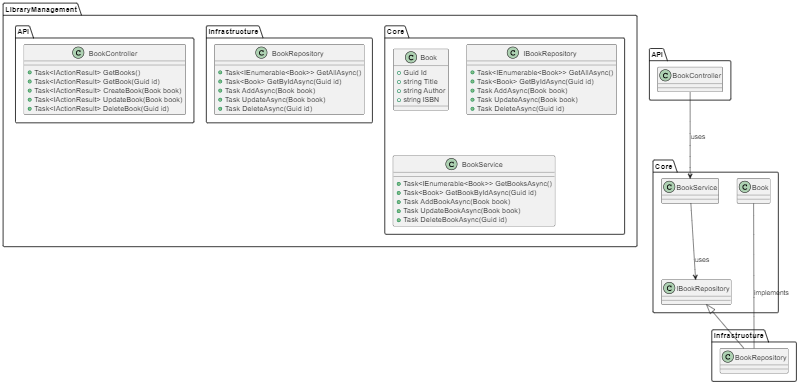
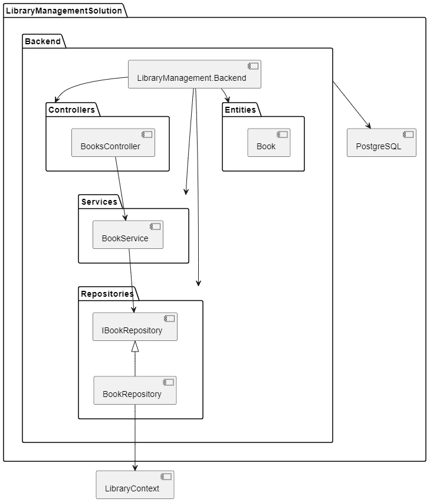
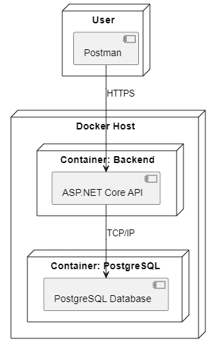
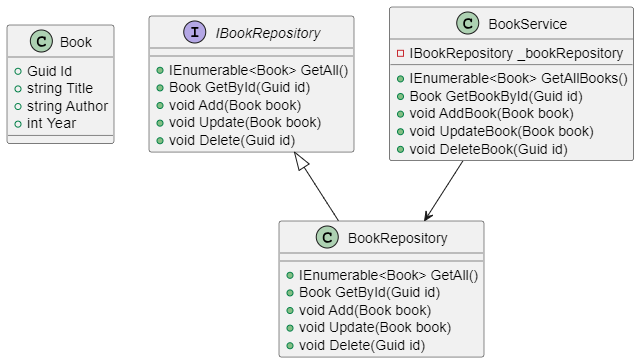

# Gestión de Libros en una Biblioteca

El siguiente ejercicio es parte del programa de entrenamiento en buenas prácticas de desarrollo de software. Le ayudará a reforzar los conocimientos sobre los Principios SOLID. El material es extenso, con muchos detalles y acciones que requieren de su entera atención, pero estamos seguros de que le será de mucha utilidad.

## Estructura del Proyecto

Construiremos un servicio Web Rest para la administración de libros en una biblioteca, y estará estructurada de la siguiente manera:

- **Backend**: Contendrá la API para la gestión de libros.
- **Base de Datos**: PostgreSQL contenerizada.

## Diagramas UML

A continuación encontrar los diagramas que explican la aplicación.

### Diagrama de Arquitectura



### Diagrama de Componentes



### Diagrama de Despliegue



### Diagrama de Clases



**Importante:** Si tiene problemas para ver los diagramas y está utilizando VS Code, le recomendamos instalar la extensión oficial de PlantUML. Luego, copie y pegue el código en un archivo con la extensión `.puml` para poder visualizarlo correctamente.

---

## Infraestructura y ambiente

El ejercicio, requiere de una instancia de base de datos PostgreSQL y de una instancia de PGAdmin.  Para completar estas tareas previas, clone el repositorio **hands-onlabs-infra** - <https://github.com/jpcv19/hands-onlabs-infra.git> y complete las instrucciones del archivo README.md, que acompaña al repositorio.  Regrese a este artículo cuando concluya.

### 1. Estructura de directorios

Abra una terminal ejecute los siguientes comando, le recomendamos copiar cada línea por separado.

```powershell
mkdir -p ~\source\repos\hands-onlabs\session2\01
cd ~\source\repos\hands-onlabs\session2\01
```

## Configuración Inicial del Proyecto

### 1. Crear la solución y los proyectos

Vamos a crear cada uno de los proyectos que conformaran nuestra solución final.

1.1 Crear la solución

```powershell
dotnet new sln -n LibraryManagement
dotnet dev-certs https --trust
```

1.2 Crear el proyecto Backend

```powershell
dotnet new webapi -n LibraryManagement.Backend --framework net8.0 --use-controllers --use-program-main
```

1.3 Agregar los proyectos a la solución

```powershell
dotnet sln add ./LibraryManagement.Backend/LibraryManagement.Backend.csproj
```

### 2. Crear la estructura DDD

Dentro del proyecto `LibraryManagement.Backend`, debe crear los directorios para Domain, Application, e Infrastructure.  Copie cada instrucción por separado.

```powershell
mkdir -p LibraryManagement.Backend/Domain/Entities
mkdir -p LibraryManagement.Backend/Domain/Interfaces
mkdir -p LibraryManagement.Backend/Application/Services
mkdir -p LibraryManagement.Backend/Infrastructure/Repositories
mkdir -p LibraryManagement.Backend/Infrastructure/Data
```

### 3. Valide que todo compile

```powershell
dotnet build .
```

## Implementación del Backend

### Instalación de dependencia de desarrollo

Deberá instalar de forma global en su entorno, la herramienta `dotnet-ef`, esto le permitirá aplicar las migraciones de base de datos.

```powershell
dotnet tool install --global dotnet-ef
```

> Las migraciones de base de datos es un concepto propio de Entity Framework (Core), si desea profundizar en el tema, lo invito a explorar este [sitio](https://learn.microsoft.com/en-us/ef/core/managing-schemas/migrations/?tabs=dotnet-core-cli).

Ahora instale los paquetes Nuget requeridos.  Copie cada comando por separado.

```powershell
dotnet add package Microsoft.EntityFrameworkCore.Design
dotnet add package Npgsql.EntityFrameworkCore.PostgreSQL
```

### Entidad Libro (Book) - SRP y OCP

En el explorador de soluciones, localice `LibraryManagement.Backend\Domain\Entities` y cree el archivo `Book.cs`, copie y pegue lo que se encuentra en el siguiente fragmento de código.

```csharp
namespace LibraryManagement.Backend.Domain.Entities
{
    public class Book
    {
        public Guid Id { get; set; }
        public string Title { get; set; }
        public string Author { get; set; }
        public int Year { get; set; }
    }
}
```

### Repositorio de Libros (IBookRepository) - DIP

En el explorador de soluciones, localice `LibraryManagement.Backend\Domain\Interfaces` y cree el archivo `IBookRepository.cs`, copie y pegue lo que se encuentra en el siguiente fragmento de código.

```csharp
using LibraryManagement.Backend.Domain.Entities;

namespace LibraryManagement.Backend.Domain.Interfaces
{
    public interface IBookRepository
    {
        IEnumerable<Book> GetAll();
        Book GetById(Guid id);
        void Add(Book book);
        void Update(Book book);
        void Delete(Guid id);
    }
}
```

### Implementación del Repositorio (BookRepository) y el DBContext- LSP

En el explorador de soluciones, localice `LibraryManagement.Backend\Infrastructure\Repositories` y cree el archivo `BookRepository.cs`, copie y pegue lo que se encuentra en el siguiente fragmento de código.

```csharp
using LibraryManagement.Backend.Domain.Entities;
using LibraryManagement.Backend.Domain.Interfaces;
using LibraryManagement.Backend.Infrastructure.Data;

namespace LibraryManagement.Backend.Infrastructure.Repositories
{
    public class BookRepository : IBookRepository
    {
        private readonly LibraryContext context;

        public BookRepository(LibraryContext context)
        {
            this.context = context ?? throw new ArgumentNullException(nameof(context));
        }

        public IEnumerable<Book> GetAll()
        {
            return context.Books.ToList<Book>();
        }

        public Book GetById(Guid id)
        {
            return context.Books.FirstOrDefault(b => b.Id == id);
        }

        public void Add(Book book)
        {
            context.Books.Add(book);
            context.SaveChangesAsync();
        }

        public void Update(Book book)
        {
            var existingBook = GetById(book.Id);
            if (existingBook != null)
            {
                existingBook.Title = book.Title;
                existingBook.Author = book.Author;
                existingBook.Year = book.Year;
            }
            context.Books.Update(existingBook);
            context.SaveChangesAsync();
        }

        public void Delete(Guid id)
        {
            var book = GetById(id);
            if (book != null)
            {
                context.Books.Remove(book);
                context.SaveChangesAsync();
            }
        }
    }
}
```

En el explorador de soluciones, localice `LibraryManagement.Backend\Infrastructure\Data` y cree el archivo `LibraryContext.cs`, copie y pegue lo que se encuentra en el siguiente fragmento de código.

```csharp
using LibraryManagement.Backend.Domain.Entities;
using Microsoft.EntityFrameworkCore;

namespace LibraryManagement.Backend.Infrastructure.Data
{
    public class LibraryContext : DbContext
    {
        public LibraryContext(DbContextOptions<LibraryContext> options) : base(options) { }

        public DbSet<Book> Books { get; set; }
    }
}
```

### Servicio de Libros (BookService) - SRP y DIP

En el explorador de soluciones, localice `LibraryManagement.Backend\Application\Services` y cree el archivo `BookService.cs`, copie y pegue lo que se encuentra en el siguiente fragmento de código.

```csharp
using LibraryManagement.Backend.Domain.Entities;
using LibraryManagement.Backend.Domain.Interfaces;

namespace LibraryManagement.Backend.Application.Services
{
    public class BookService
    {
        private readonly IBookRepository _bookRepository;

        public BookService(IBookRepository bookRepository)
        {
            _bookRepository = bookRepository ?? throw new ArgumentNullException(nameof(bookRepository));
        }

        public IEnumerable<Book> GetAllBooks()
        {
            return _bookRepository.GetAll();
        }

        public Book GetBookById(Guid id)
        {
            return _bookRepository.GetById(id);
        }

        public void AddBook(Book book)
        {
            _bookRepository.Add(book);
        }

        public void UpdateBook(Book book)
        {
            _bookRepository.Update(book);
        }

        public void DeleteBook(Guid id)
        {
            _bookRepository.Delete(id);
        }
    }
}
```

### Controlador de la API - ISP

En el explorador de soluciones, localice `LibraryManagement.Backend\Controllers`, borre el archivo `WeatherForecastController.cs`, que es incluido por defecto por el CLI de DotNet.  Cree el archivo `BooksController.cs`, copie y pegue lo que se encuentra en el siguiente fragmento de código.

```csharp
using Microsoft.AspNetCore.Mvc;
using LibraryManagement.Backend.Application.Services;
using LibraryManagement.Backend.Domain.Entities;

namespace LibraryManagement.Backend.Controllers
{
    [ApiController]
    [Route("api/[controller]")]
    public class BooksController : ControllerBase
    {
        private readonly BookService _bookService;

        public BooksController(BookService bookService)
        {
            _bookService = bookService;
        }

        [HttpGet]
        public ActionResult<IEnumerable<Book>> GetAll()
        {
            return Ok(_bookService.GetAllBooks());
        }

        [HttpGet("{id}")]
        public ActionResult<Book> GetById(Guid id)
        {
            var book = _bookService.GetBookById(id);
            if (book == null)
            {
                return NotFound();
            }
            return Ok(book);
        }

        [HttpPost]
        public IActionResult Add(Book book)
        {
            _bookService.AddBook(book);
            return CreatedAtAction(nameof(GetById), new { id = book.Id }, book);
        }

        [HttpPut("{id}")]
        public IActionResult Update(Guid id, Book book)
        {
            if (id != book.Id)
            {
                return BadRequest();
            }

            _bookService.UpdateBook(book);
            return NoContent();
        }

        [HttpDelete("{id}")]
        public IActionResult Delete(Guid id)
        {
            _bookService.DeleteBook(id);
            return NoContent();
        }
    }
}
```

### Configuración de la Inyección de Dependencias - DIP

Luego de crear todas las clases que componen nuestros servicio, vamos a configurar el Contener de Inversión de Control de .Net.

En el explorador de soluciones, localice el archivo `WeatherForecast.cs` y bórrelo.  Abra el archivo `Program.cs`, seleccione todo el contenido y bórrelo.  Copie y pegue lo que se encuentra en el siguiente fragmento de código.

```csharp
using LibraryManagement.Backend.Domain.Interfaces;
using LibraryManagement.Backend.Infrastructure.Repositories;
using LibraryManagement.Backend.Application.Services;
using LibraryManagement.Backend.Infrastructure.Data;
using Microsoft.EntityFrameworkCore;

var builder = WebApplication.CreateBuilder(args);

IHostEnvironment env = builder.Environment;

builder.Configuration
    .AddJsonFile("appsettings.json", optional: true, reloadOnChange: true)
    .AddEnvironmentVariables();

//Add DBContext
builder.Services.AddDbContext<LibraryContext>(options =>
    options.UseNpgsql(builder.Configuration.GetConnectionString("DefaultConnection")));

// Add services to the container.
builder.Services.AddScoped<IBookRepository, BookRepository>();
builder.Services.AddScoped<BookService>();

builder.Services.AddControllers();
builder.Services.AddEndpointsApiExplorer();
builder.Services.AddSwaggerGen();

var app = builder.Build();

// Configure the HTTP request pipeline.
if (app.Environment.IsDevelopment())
{
    app.UseSwagger();
    app.UseSwaggerUI();
}

using (var scope = app.Services.CreateScope())
{
    var services = scope.ServiceProvider;

    var context = services.GetRequiredService<LibraryContext>();
    context.Database.Migrate();
}

app.UseHttpsRedirection();

app.UseAuthorization();

app.MapControllers();

app.Run();
```

### Connection String

En el explorador de soluciones, localice el archivo `appsettings.json`.  Copie y pegue lo que se encuentra en el siguiente fragmento de código.

```json
{
  "Logging": {
    "LogLevel": {
      "Default": "Information",
      "Microsoft.AspNetCore": "Warning"
    }
  },
  "AllowedHosts": "*",
  "ConnectionStrings": {
    "DefaultConnection": "Host=localhost;Port=5050;Database=LibraryDb;Username=postgres;Password=postgres"
  }
}

```

> **Importante** Antes de avanzar compile el proyecto para asegurarse de haber completado todos los pasos y poder avanzar a la siguiente sección sin errores. Si no recuerda el comando necesario, consulte "3. Valide que todo compile" al inicio de esta guía.

### Cree la primera migración.  

Para esto, abra una terminal y navegue hasta el directorio raíz del proyecto `LibraryManagement.Backend`.  Y ejecute el siguiente comando.

```powershell
dotnet ef migrations add InitialCreate -o Infrastructure/Data/Migrations
```

Deberá obtener una salida como la siguiente

```powershell
dotnet ef migrations add InitialCreate -o Infrastructure/Data/Migrations
Build started...
Build succeeded.
Done. To undo this action, use 'ef migrations remove'
```

Por ultimo ejecute a migración contra la base de datos, para así crear los objetos requeridos por este ejercicio.  Para dicha tarea en su línea  de comandos, ejecute:

```powershell
dotnet ef database update
```

Deberá obtener una salida como la siguiente:

```powershell
Build started...
Build succeeded.
info: Microsoft.EntityFrameworkCore.Database.Command[20101]
      Executed DbCommand (43ms) [Parameters=[], CommandType='Text', CommandTimeout='30']
      SELECT EXISTS (
    SELECT 1 FROM pg_catalog.pg_class c
    JOIN pg_catalog.pg_namespace n ON n.oid=c.relnamespace
    WHERE n.nspname='public' AND
          c.relname='__EFMigrationsHistory'
)
info: Microsoft.EntityFrameworkCore.Database.Command[20101]
      Executed DbCommand (4ms) [Parameters=[], CommandType='Text', CommandTimeout='30']
      SELECT EXISTS (
    SELECT 1 FROM pg_catalog.pg_class c
    JOIN pg_catalog.pg_namespace n ON n.oid=c.relnamespace
    WHERE n.nspname='public' AND
          c.relname='__EFMigrationsHistory'
)
info: Microsoft.EntityFrameworkCore.Database.Command[20101]
      Executed DbCommand (178ms) [Parameters=[], CommandType='Text', CommandTimeout='30']
      CREATE TABLE "__EFMigrationsHistory" (
          "MigrationId" character varying(150) NOT NULL,
          "ProductVersion" character varying(32) NOT NULL,
          CONSTRAINT "PK___EFMigrationsHistory" PRIMARY KEY ("MigrationId")
      );
info: Microsoft.EntityFrameworkCore.Database.Command[20101]
      Executed DbCommand (1ms) [Parameters=[], CommandType='Text', CommandTimeout='30']
      SELECT EXISTS (
    SELECT 1 FROM pg_catalog.pg_class c
    JOIN pg_catalog.pg_namespace n ON n.oid=c.relnamespace
    WHERE n.nspname='public' AND
          c.relname='__EFMigrationsHistory'
)
info: Microsoft.EntityFrameworkCore.Database.Command[20101]
      Executed DbCommand (7ms) [Parameters=[], CommandType='Text', CommandTimeout='30']
      SELECT "MigrationId", "ProductVersion"
      FROM "__EFMigrationsHistory"
      ORDER BY "MigrationId";
info: Microsoft.EntityFrameworkCore.Migrations[20402]
      Applying migration '20240610174930_InitialCreate'.
Applying migration '20240610174930_InitialCreate'.
info: Microsoft.EntityFrameworkCore.Database.Command[20101]
      Executed DbCommand (57ms) [Parameters=[], CommandType='Text', CommandTimeout='30']
      CREATE TABLE "Books" (
          "Id" uuid NOT NULL,
          "Title" text NOT NULL,
          "Author" text NOT NULL,
          "Year" integer NOT NULL,
          CONSTRAINT "PK_Books" PRIMARY KEY ("Id")
      );
info: Microsoft.EntityFrameworkCore.Database.Command[20101]
      Executed DbCommand (7ms) [Parameters=[], CommandType='Text', CommandTimeout='30']
      INSERT INTO "__EFMigrationsHistory" ("MigrationId", "ProductVersion")
      VALUES ('20240610174930_InitialCreate', '8.0.6');
Done.
```

>Si desea puede validar que la tabla Books en efecto se creó en la base de datos, utilizando PGAdmin4.

### Dockerización del Backend

Con nuestro servicio finalizado y compilando, vamos a iniciar con los pasos para poder contenerizar nuestra aplicación

#### Dockerfile

En el Explorador de Soluciones, navegue hasta el directorio raíz del proyecto LibraryManagement.Backend y cree el archivo `Dockerfile`. Luego, reemplace todo el contenido con el siguiente fragmento de código.

```dockerfile
# Stage 1: Build
FROM mcr.microsoft.com/dotnet/sdk:8.0.203-alpine3.19-amd64 AS build
WORKDIR /app

# Copy csproj and restore as distinct layers
# COPY *.sln .
COPY LibraryManagement.Backend/LibraryManagement.Backend.csproj ./LibraryManagement.Backend/
RUN dotnet restore LibraryManagement.Backend/LibraryManagement.Backend.csproj

# Copy everything else and build
COPY . .
WORKDIR /app/LibraryManagement.Backend
RUN dotnet publish -c Release -o out

# Stage 2: Serve
FROM mcr.microsoft.com/dotnet/aspnet:8.0.3-alpine3.19-amd64 AS runtime
WORKDIR /app
COPY --from=build /app/LibraryManagement.Backend/out ./
ENTRYPOINT ["dotnet", "LibraryManagement.Backend.dll"]
```

#### Docker Compose para el Backend

Cree el archivo `docker-compose.yaml`. Luego, copie y pegue el fragmento de código.

**docker-compose.yaml**

```yaml
services:
  api:
    build:
      context: .
      dockerfile: LibraryManagement.Backend/Dockerfile
    container_name: library_api
    environment:
      - ASPNETCORE_ENVIRONMENT=Development
      - ConnectionStrings__DefaultConnection=Host=host.docker.internal;Port=5050;Database=LibraryDb;Username=postgres;Password=postgres
    ports:
      - "5000:8080"
    networks:
      - library_net
    healthcheck:
      test: ["CMD-SHELL", "curl -f http://localhost:8080/health || exit 1"]
      interval: 30s
      timeout: 10s
      retries: 3
    restart: unless-stopped

networks:
  library_net:
    driver: bridge
```

---

#### Despliegue

En este punto tiene todos los artefactos necesarios para desplegar el primer contenedor de su aplicación.

Ejecute el siguiente comando en su terminal, asegúrese que se encuentra en `~\source\repos\hands-onlabs\session2\01\LibraryManagement.Backend\`

```powershell
docker compose --project-name librarymanagement_backend -f "docker-compose.yaml" up -d --build
```

#### Pruebas

> Para completar esta sección necesita una cuenta de Postman y la última versión de la herramienta instalada en su equipo.

Cree un nuevo `Workspace` y nómbrelo `Hands-On Labs`.  Luego importe la definición OpenAPI del servicio, desde la URL: `http://localhost:5000/swagger/v1/swagger.json`.  Esto importará todos los métodos expuestos por su Web API.

Navegue hasta la definición de su **Collection**, localice el Tab **Variables** y ajuste el valor de la variable `baseUrl` a `http://localhost:5000`.

Realice pruebas con su servicio, cree libros, recupere todos los registros, actualice y elimine registros.

**IMPORTANTE**

Llegado a este punto avise al instructor, vamos a tomar un pausa para analizar los principios SOLID que hemos aplicado a la construcción del servicios.

Le invitamos a seguir explorando el uso de buenas prácticas de desarrollo.  Y le recomendamos explorar la construcción de un Frontend en Angular, que le permita consumir el servicio y mostrar los datos en pantalla.
